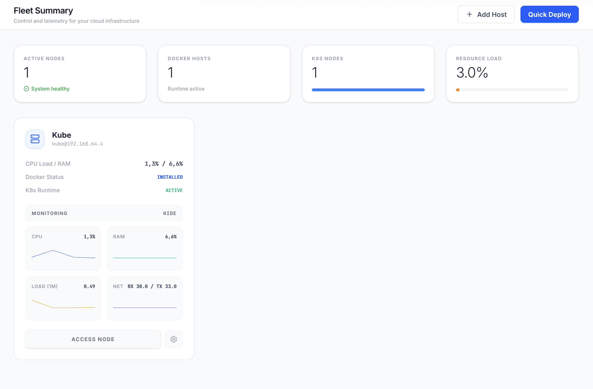

# Server Deployment: Docker & Kubernetes
This repository provides a streamlined approach to installing and deploying Docker and Kubernetes on a server environment. The project focuses on transitioning a machine into a lean, headless node capable of managing containerized workloads via SSH.

## Key Features
- Automated Runtime Setup: Simplifies the installation of the Docker Engine.
- Cluster Orchestration: Configures Kubernetes components for immediate cluster initialization.
- Infrastructure as Code: Includes deployment configurations to reduce manual setup errors.
- System Optimization: Designed for minimal environments to maximize resource availability for containers.
- Monitoring: Shows system health and traffic load.
- Prod Test: Checks if everything on the sever is up and running and gives back a system report.
- Nuke Server: Get rid of all KubeCast related content on a server.

  
## Tech Stack
- Runtime: Docker
- Orchestration: Kubernetes
  
## Prerequisites
- A Linux-based server environment
- Sudo or root privileges
- Active network access for package distribution and image pulling

Development Note:
This project was developed using AI-assisted workflows.
